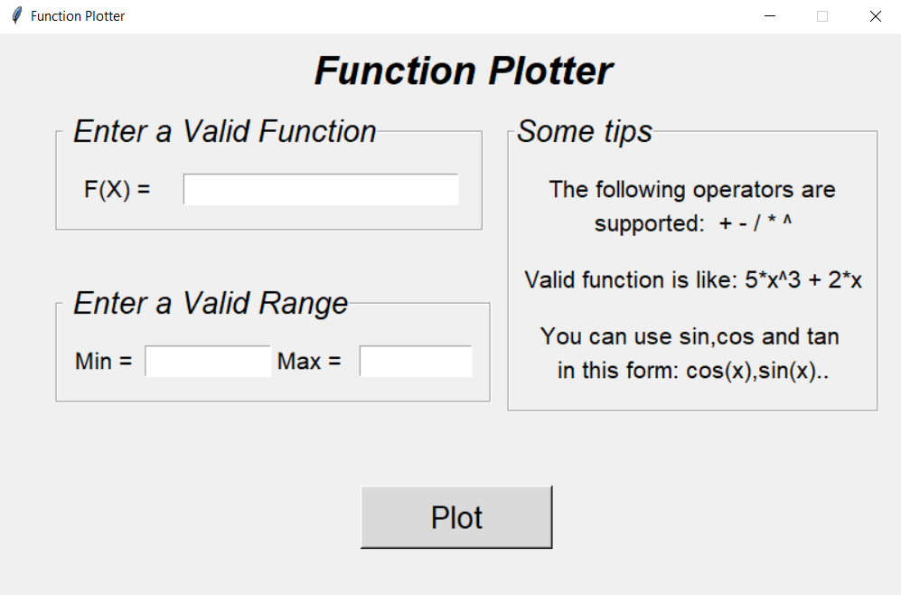
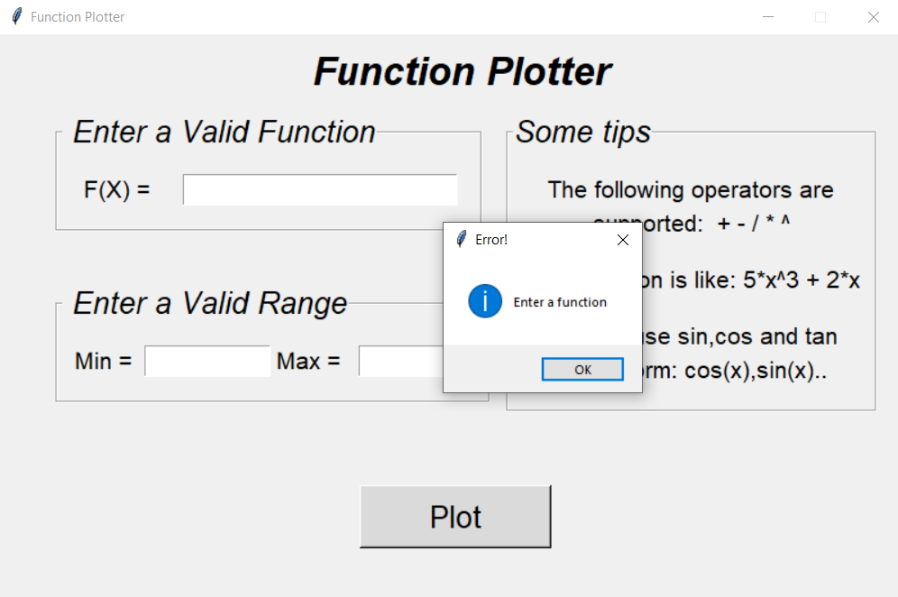
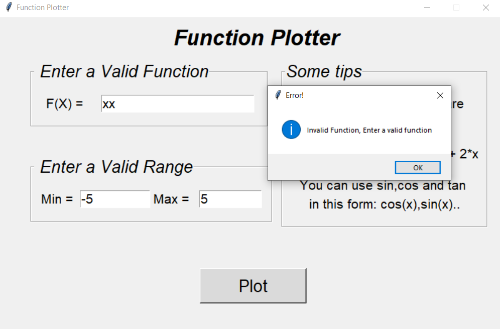
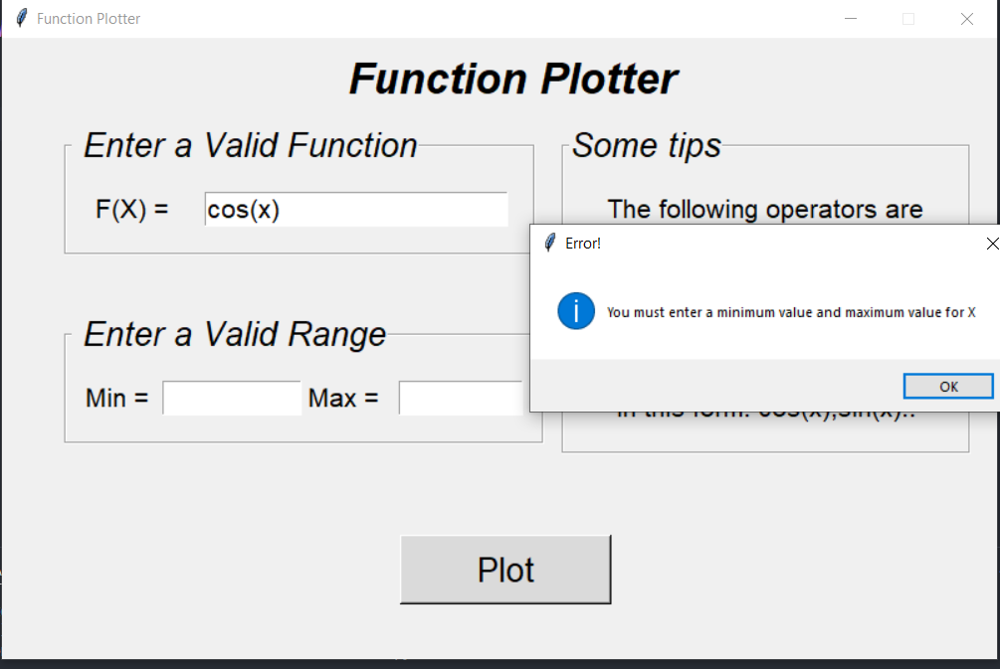
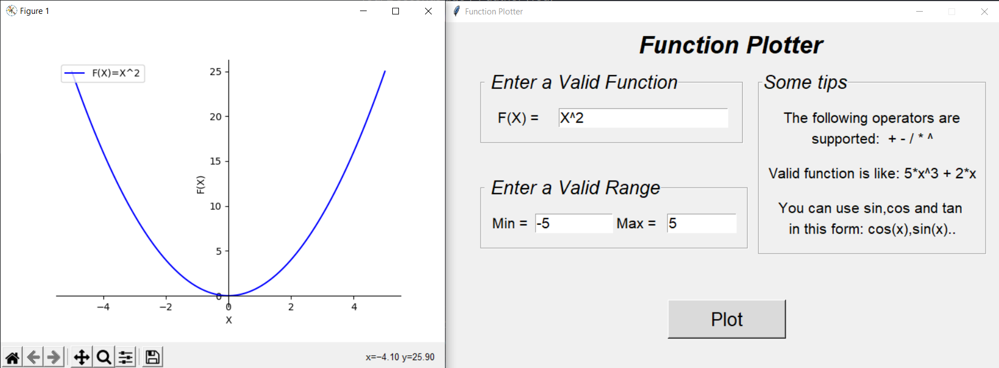
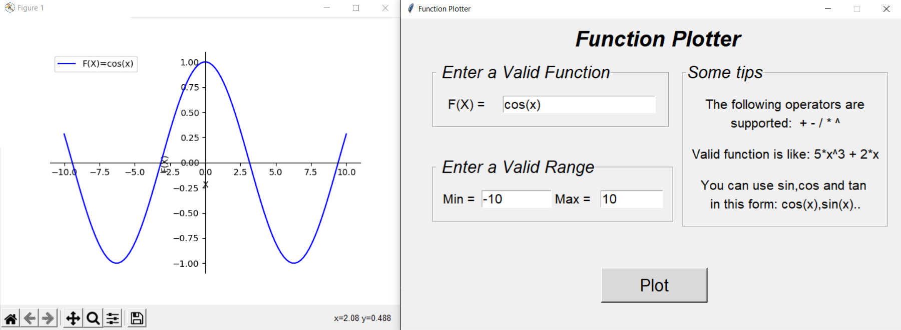

<div align="center">
<a href="https://github.com/ZeyadTarekk/Function-Plotter" rel="noopener">

</a>

</div>

<div align="center">

[](https://github.com/ZeyadTarekk/Function-Plotter/contributors)
[](https://github.com/ZeyadTarekk/Function-Plotter/issues)
[](https://github.com/ZeyadTarekk/Function-Plotter/blob/master/LICENSE)
[](https://github.com/ZeyadTarekk/Function-Plotter/network)
[](https://github.com/ZeyadTarekk/Function-Plotter/stargazers)
[](https://img.shields.io/github/languages/count/ZeyadTarekk/Function-Plotter)

</div>

## 📝 Table of Contents

- [About](#about)
- [Get started](#get-started)
  - [Installation](#Install)
  - [Running](#running)
- [Technology](#tech)
- [Screenshots](#Screenshots)
- [Contributors](#Contributors)
- [License](#license)

## 📙 About <a name = "about"></a>

- GUI program that plots arbitrary user-entered function.

## 🏁 Getting Started <a name = "get-started"></a>

> This is an list of needed instructions to set up your project locally, to get a local copy up and running follow these
> instructuins.

### Installation <a name = "Install"></a>

1. **_Clone the repository_**

```sh
$ git clone https://github.com/ZeyadTarekk/Function-Plotter.git
```

2. **_Navigate to repository directory_**

```sh
$ cd Function-Plotter
```

3. **_Install dependencies_**

```sh
1- pip install matplotlib
```

```sh
2- pip install numpy
```

### Running <a name = "running"></a>

1. **_Running program_**

```sh
python main.py
```
1. **_Running tests_**

```sh
python test.py
```

## 💻 Built Using <a name = "tech"></a>

- **Python**

## 📷 Demo Screenshots <a name = "Screenshots"></a>

<div align="center">
<h3 align='left'>Main Screen</h3>
   
<h3 align='left'>Errors</h3>
   </a>
   </a>

</a>

<h3 align='left'>Valid Examples</h3>
</a>
</a>

</div>


## Contributors <a name = "Contributors"></a>

<table>
  <tr>
    <td align="center">
    <a href="https://github.com/ZeyadTarekk" target="_black">
    
    <br />
    <sub><b>Zeyad Tarek</b></sub></a>
    </td>
    
    
  </tr>
 </table>

 ## License <a name = "license"></a>

> This software is licensed under MIT License, See [License](https://github.com/ZeyadTarekk/Function-Plotter/blob/main/LICENSE) for more information ©ZeyadTarekk.